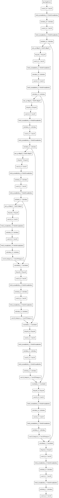
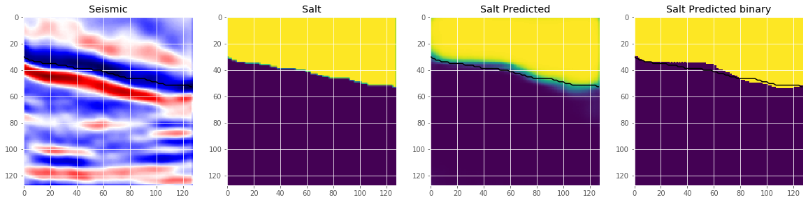
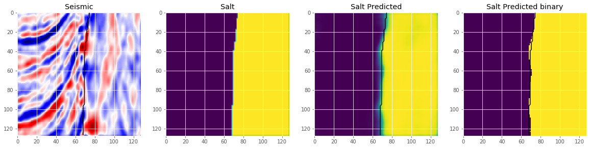

# A UNet implementation in Keras

This repository contains implementation of UNet for tgs salt identification challenge (Kaggle). The implementation is in keras.

## Model Architecture

## Results

### Result1

### Result2

